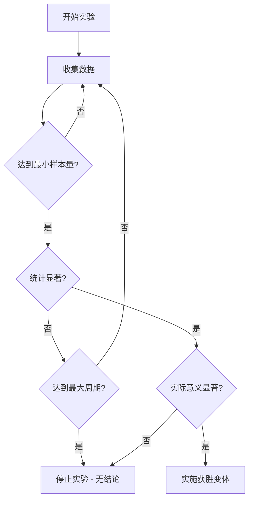

# 🧪 AB测试实施指南

## 📋 目录
1. [AB测试概念](#ab测试概念)
2. [工具选择对比](#工具选择对比)
3. [实施方案](#实施方案)
4. [代码实现](#代码实现)
5. [数据分析](#数据分析)
6. [最佳实践](#最佳实践)
7. [成本分析](#成本分析)
8. [实战案例](#实战案例)

---

## 🎯 AB测试概念

### 什么是AB测试？
AB测试（A/B Testing）是一种对照实验，通过将用户随机分为两组或多组，展示不同版本的页面或功能，比较哪个版本效果更好。

### 核心价值
- **数据驱动决策**：基于真实用户行为数据
- **降低风险**：小范围测试，避免全量发布问题
- **提升转化率**：持续优化用户体验
- **量化效果**：精确衡量改进效果

### 适用场景
- 🎨 **UI/UX优化**：按钮颜色、位置、文案
- 📄 **页面布局**：不同的页面结构和内容排列
- 💰 **定价策略**：不同的价格展示方式
- 📧 **营销活动**：邮件标题、推送内容
- 🔧 **功能测试**：新功能的不同实现方式

---

## 🛠️ 工具选择对比

### 1. Google Optimize（推荐 - 免费）
```typescript
优势：
✅ 与Google Analytics深度集成
✅ 完全免费（2023年停止服务，建议替代方案）
✅ 可视化编辑器
✅ 服务器端测试支持
```

### 2. **Vercel Edge Config + Analytics（推荐）**
```typescript
优势：
✅ 与Next.js完美集成
✅ 边缘计算，性能优异
✅ 免费额度充足
✅ 实时配置更新
✅ TypeScript原生支持
```

### 3. PostHog（开源推荐）
```typescript
优势：
✅ 开源免费
✅ 功能丰富（AB测试、用户分析、会话录制）
✅ 隐私友好
✅ 自托管选项
```

### 4. Split.io（企业级）
```typescript
优势：
✅ 企业级功能
✅ 实时特性开关
✅ 详细的统计分析
❌ 成本较高
```

### 5. Optimizely（专业级）
```typescript
优势：
✅ 行业标准工具
✅ 高级统计功能
✅ 企业级支持
❌ 价格昂贵
```

---

## 🚀 实施方案

### 方案1：Vercel Edge Config + Next.js（推荐）

#### 优势分析
- **性能优异**：边缘计算，全球CDN分发
- **成本低廉**：Vercel免费额度充足
- **集成简单**：与现有Next.js架构无缝集成
- **实时更新**：无需重新部署即可调整实验

#### 架构图
```
用户请求 → Edge Runtime → 实验分组 → 渲染对应版本 → 记录数据
```

### 方案2：PostHog集成方案

#### 适用场景
- 需要完整的用户行为分析
- 注重数据隐私
- 希望自建数据分析平台

### 方案3：自建AB测试系统

#### 适用场景
- 对数据安全有特殊要求
- 需要高度自定义功能
- 有充足的开发资源

---

## 💻 代码实现

### 方案1：Vercel Edge Config实现

#### 步骤1：安装依赖
```bash
npm install @vercel/edge-config
```

#### 步骤2：创建AB测试Hook
```typescript
// hooks/useABTest.ts
'use client'

import { useState, useEffect } from 'react'
import { get } from '@vercel/edge-config'

interface ABTestConfig {
  name: string
  variants: string[]
  traffic: number // 参与测试的流量比例 (0-1)
}

export function useABTest(testName: string) {
  const [variant, setVariant] = useState<string>('control')
  const [isLoading, setIsLoading] = useState(true)

  useEffect(() => {
    async function initABTest() {
      try {
        // 获取用户ID（基于session或cookie）
        let userId = localStorage.getItem('ab_user_id')
        if (!userId) {
          userId = Math.random().toString(36).substring(7)
          localStorage.setItem('ab_user_id', userId)
        }

        // 从Edge Config获取实验配置
        const config = await get<ABTestConfig>(testName)
        
        if (!config || !config.variants) {
          setVariant('control')
          setIsLoading(false)
          return
        }

        // 计算用户是否参与实验
        const hash = simpleHash(userId + testName)
        const shouldParticipate = (hash % 100) / 100 < config.traffic

        if (!shouldParticipate) {
          setVariant('control')
          setIsLoading(false)
          return
        }

        // 分配变体
        const variantIndex = hash % config.variants.length
        const selectedVariant = config.variants[variantIndex]
        
        setVariant(selectedVariant)
        
        // 记录实验参与事件
        if (typeof window !== 'undefined' && window.gtag) {
          window.gtag('event', 'ab_test_participate', {
            'test_name': testName,
            'variant': selectedVariant,
            'user_id': userId
          })
        }
        
      } catch (error) {
        console.error('AB Test Error:', error)
        setVariant('control')
      } finally {
        setIsLoading(false)
      }
    }

    initABTest()
  }, [testName])

  return { variant, isLoading }
}

// 简单哈希函数
function simpleHash(str: string): number {
  let hash = 0
  for (let i = 0; i < str.length; i++) {
    const char = str.charCodeAt(i)
    hash = ((hash << 5) - hash) + char
    hash = hash & hash // 转换为32位整数
  }
  return Math.abs(hash)
}
```

#### 步骤3：创建AB测试组件
```typescript
// components/ab-test-wrapper.tsx
'use client'

import React from 'react'
import { useABTest } from '@/hooks/useABTest'

interface ABTestWrapperProps {
  testName: string
  children: {
    [variantName: string]: React.ReactNode
  }
  fallback?: React.ReactNode
}

export function ABTestWrapper({ testName, children, fallback }: ABTestWrapperProps) {
  const { variant, isLoading } = useABTest(testName)

  if (isLoading) {
    return fallback || null
  }

  return <>{children[variant] || children.control || fallback}</>
}
```

#### 步骤4：在页面中使用
```typescript
// app/page.tsx 示例
import { ABTestWrapper } from '@/components/ab-test-wrapper'

export default function HomePage() {
  return (
    <div>
      <h1>BrickRecipes</h1>
      
      {/* AB测试：首页CTA按钮 */}
      <ABTestWrapper testName="homepage_cta_button">
        {{
          control: (
            <button className="bg-blue-500 text-white px-6 py-3 rounded">
              开始探索食谱
            </button>
          ),
          variant_a: (
            <button className="bg-green-500 text-white px-8 py-4 rounded-lg text-lg">
              立即发现美食
            </button>
          ),
          variant_b: (
            <button className="bg-red-500 text-white px-6 py-3 rounded border-2 border-red-700">
              🍳 开始烹饪之旅
            </button>
          )
        }}
      </ABTestWrapper>

      {/* AB测试：价格展示方式 */}
      <ABTestWrapper testName="pricing_display">
        {{
          control: (
            <div className="text-2xl font-bold">¥29.9/月</div>
          ),
          variant_a: (
            <div>
              <span className="text-gray-500 line-through">¥39.9</span>
              <span className="text-2xl font-bold text-red-500 ml-2">¥29.9/月</span>
            </div>
          )
        }}
      </ABTestWrapper>
    </div>
  )
}
```

### 方案2：PostHog集成实现

#### 步骤1：安装PostHog
```bash
npm install posthog-js
```

#### 步骤2：配置PostHog
```typescript
// lib/posthog.ts
import posthog from 'posthog-js'

if (typeof window !== 'undefined') {
  posthog.init(process.env.NEXT_PUBLIC_POSTHOG_KEY!, {
    api_host: process.env.NEXT_PUBLIC_POSTHOG_HOST || 'https://app.posthog.com',
    // 确保在中国也能使用
    disable_session_recording: false,
    capture_pageview: true,
    capture_pageleave: true,
    // 其他配置...
  })
}

export default posthog
```

#### 步骤3：创建PostHog Provider
```typescript
// components/posthog-provider.tsx
'use client'

import posthog from 'posthog-js'
import { PostHogProvider } from 'posthog-js/react'

if (typeof window !== 'undefined') {
  posthog.init(process.env.NEXT_PUBLIC_POSTHOG_KEY!, {
    api_host: 'https://app.posthog.com',
  })
}

export function PHProvider({ children }: { children: React.ReactNode }) {
  return <PostHogProvider client={posthog}>{children}</PostHogProvider>
}
```

#### 步骤4：PostHog AB测试Hook
```typescript
// hooks/usePostHogABTest.ts
import { useFeatureFlagEnabled } from 'posthog-js/react'

export function usePostHogABTest(flagKey: string) {
  const isEnabled = useFeatureFlagEnabled(flagKey)
  return isEnabled
}
```

---

## 📊 数据分析

### 关键指标定义

#### 1. 技术指标
```typescript
interface ABTestMetrics {
  // 基础指标
  participants: number        // 参与人数
  conversions: number        // 转化人数
  conversionRate: number     // 转化率
  
  // 统计指标
  confidence: number         // 置信度
  pValue: number            // P值
  significance: boolean      // 是否显著
  
  // 业务指标
  revenue?: number          // 收入
  averageOrderValue?: number // 客单价
  retention?: number        // 留存率
}
```

#### 2. 统计显著性计算
```typescript
// utils/statistics.ts
export function calculateSignificance(
  controlConversions: number,
  controlVisitors: number,
  variantConversions: number,
  variantVisitors: number
): {
  pValue: number
  confidence: number
  isSignificant: boolean
} {
  const p1 = controlConversions / controlVisitors
  const p2 = variantConversions / variantVisitors
  
  const pooledP = (controlConversions + variantConversions) / 
                  (controlVisitors + variantVisitors)
  
  const se = Math.sqrt(pooledP * (1 - pooledP) * 
                      (1/controlVisitors + 1/variantVisitors))
  
  const zScore = (p2 - p1) / se
  const pValue = 2 * (1 - normalCDF(Math.abs(zScore)))
  
  return {
    pValue,
    confidence: 1 - pValue,
    isSignificant: pValue < 0.05
  }
}

function normalCDF(x: number): number {
  // 标准正态分布累积密度函数近似
  return 0.5 * (1 + erf(x / Math.sqrt(2)))
}

function erf(x: number): number {
  // 误差函数近似
  const a1 =  0.254829592
  const a2 = -0.284496736
  const a3 =  1.421413741
  const a4 = -1.453152027
  const a5 =  1.061405429
  const p  =  0.3275911

  const sign = x >= 0 ? 1 : -1
  x = Math.abs(x)

  const t = 1.0 / (1.0 + p * x)
  const y = 1.0 - (((((a5 * t + a4) * t) + a3) * t + a2) * t + a1) * t * Math.exp(-x * x)

  return sign * y
}
```

### 分析仪表板组件
```typescript
// components/ab-test-dashboard.tsx
'use client'

import { useState, useEffect } from 'react'
import { calculateSignificance } from '@/utils/statistics'

interface TestResult {
  name: string
  variant: string
  visitors: number
  conversions: number
  conversionRate: number
}

export function ABTestDashboard() {
  const [results, setResults] = useState<TestResult[]>([])

  useEffect(() => {
    // 从Analytics API获取数据
    fetchTestResults()
  }, [])

  const fetchTestResults = async () => {
    // 实现数据获取逻辑
    // 可以从Google Analytics、百度统计或自建数据库获取
  }

  return (
    <div className="space-y-6">
      <h2 className="text-2xl font-bold">AB测试结果</h2>
      
      {results.map((result) => (
        <div key={`${result.name}-${result.variant}`} 
             className="border rounded-lg p-4">
          <h3 className="text-lg font-semibold">{result.name}</h3>
          <div className="grid grid-cols-4 gap-4 mt-2">
            <div>
              <div className="text-sm text-gray-600">变体</div>
              <div className="font-bold">{result.variant}</div>
            </div>
            <div>
              <div className="text-sm text-gray-600">访客数</div>
              <div className="font-bold">{result.visitors.toLocaleString()}</div>
            </div>
            <div>
              <div className="text-sm text-gray-600">转化数</div>
              <div className="font-bold">{result.conversions.toLocaleString()}</div>
            </div>
            <div>
              <div className="text-sm text-gray-600">转化率</div>
              <div className="font-bold">
                {(result.conversionRate * 100).toFixed(2)}%
              </div>
            </div>
          </div>
        </div>
      ))}
    </div>
  )
}
```

---

## 🎯 最佳实践

### 1. 实验设计原则

#### 明确假设
```markdown
❌ 错误：改变按钮颜色可能会提高点击率
✅ 正确：将CTA按钮从蓝色改为绿色，预计可提高点击率15%，
         因为绿色在视觉心理学中代表积极行动
```

#### 样本量计算
```typescript
// 实验开始前计算所需样本量
function calculateSampleSize(
  baseConversionRate: number,
  minimumDetectableEffect: number,
  significance: number = 0.05,
  power: number = 0.8
): number {
  // 简化的样本量计算
  const alpha = significance
  const beta = 1 - power
  
  const p1 = baseConversionRate
  const p2 = baseConversionRate * (1 + minimumDetectableEffect)
  
  // 每组所需样本量
  const n = Math.ceil(
    2 * Math.pow(1.96 + 0.84, 2) * p1 * (1 - p1) / 
    Math.pow(p2 - p1, 2)
  )
  
  return n
}

// 使用示例
const sampleSize = calculateSampleSize(
  0.05,   // 当前转化率5%
  0.20    // 希望检测到20%的提升
)
console.log(`每组需要 ${sampleSize} 个样本`)
```

### 2. 实验监控

#### 实时监控指标
```typescript
// components/ab-test-monitor.tsx
export function ABTestMonitor({ testName }: { testName: string }) {
  const [metrics, setMetrics] = useState({
    sampleRatio: 0,
    dataQuality: 'good',
    runtime: 0,
    estimatedTimeToSignificance: 0
  })

  return (
    <div className="bg-yellow-50 border border-yellow-200 rounded-lg p-4">
      <h4 className="font-semibold text-yellow-800">实验监控</h4>
      <div className="grid grid-cols-2 gap-4 mt-2 text-sm">
        <div>
          <span className="text-yellow-700">样本比例:</span>
          <span className="ml-2 font-mono">{metrics.sampleRatio.toFixed(3)}</span>
        </div>
        <div>
          <span className="text-yellow-700">数据质量:</span>
          <span className="ml-2">{metrics.dataQuality}</span>
        </div>
      </div>
    </div>
  )
}
```

### 3. 避免常见错误

#### 🚫 过早停止实验
```typescript
// 错误：看到初期数据就停止
if (earlyResults.isSignificant) {
  stopExperiment() // ❌ 危险！
}

// 正确：达到预定样本量或时间
if (totalSamples >= requiredSampleSize || daysRunning >= minDuration) {
  if (results.isSignificant) {
    stopExperiment() // ✅ 正确
  }
}
```

#### 🚫 多重比较问题
```typescript
// 错误：同时测试多个指标而不调整显著性水平
const tests = ['ctr', 'conversion', 'revenue', 'retention']
tests.forEach(metric => {
  if (testResult[metric].pValue < 0.05) { // ❌ 未调整
    console.log(`${metric} 显著`)
  }
})

// 正确：Bonferroni修正
const adjustedAlpha = 0.05 / tests.length
tests.forEach(metric => {
  if (testResult[metric].pValue < adjustedAlpha) { // ✅ 已调整
    console.log(`${metric} 显著`)
  }
})
```

---

## 💰 成本分析

### 免费方案对比
| 工具 | 月流量限制 | 实验数量 | 高级功能 |
|------|-----------|----------|----------|
| Vercel Edge Config | 无限制 | 无限制 | ✅ 边缘计算 |
| PostHog | 100万事件 | 3个并发 | ✅ 用户行为分析 |
| 自建方案 | 无限制 | 无限制 | ✅ 完全控制 |

### 付费方案对比
| 工具 | 起步价格 | 流量限制 | 企业功能 |
|------|----------|----------|----------|
| Optimizely | $50/月 | 10万访客 | ✅ 高级统计 |
| Split.io | $20/月 | 10万MAU | ✅ 特性管理 |
| PostHog Pro | $0.00045/事件 | 按使用付费 | ✅ 全功能 |

---

## 🏆 实战案例

### 案例1：首页CTA按钮优化

#### 背景
BrickRecipes首页的"开始探索"按钮点击率较低（2.3%），希望通过AB测试提升。

#### 实验设计
```typescript
// 实验配置
const ctaButtonTest = {
  name: 'homepage_cta_optimization',
  hypothesis: '更明确的行动导向文案和更醒目的视觉设计可以提升点击率',
  variants: {
    control: {
      text: '开始探索',
      color: 'blue',
      size: 'medium'
    },
    variant_a: {
      text: '立即发现美食',
      color: 'green', 
      size: 'large'
    },
    variant_b: {
      text: '🍳 开始烹饪之旅',
      color: 'orange',
      size: 'medium'
    }
  },
  trafficSplit: [40, 30, 30], // 控制组分配更多流量
  primaryMetric: 'cta_click_rate',
  secondaryMetrics: ['session_duration', 'page_depth']
}
```

#### 实施代码
```typescript
// components/homepage-cta.tsx
'use client'

import { ABTestWrapper } from '@/components/ab-test-wrapper'
import { trackEvent } from '@/lib/analytics'

export function HomepageCTA() {
  const handleClick = (variant: string) => {
    trackEvent('cta_click', {
      page: 'homepage',
      variant: variant,
      timestamp: Date.now()
    })
  }

  return (
    <ABTestWrapper testName="homepage_cta_optimization">
      {{
        control: (
          <button 
            onClick={() => handleClick('control')}
            className="bg-blue-500 hover:bg-blue-600 text-white px-6 py-3 rounded-lg transition-colors"
          >
            开始探索
          </button>
        ),
        variant_a: (
          <button 
            onClick={() => handleClick('variant_a')}
            className="bg-green-500 hover:bg-green-600 text-white px-8 py-4 rounded-lg text-lg font-semibold shadow-lg transition-all"
          >
            立即发现美食
          </button>
        ),
        variant_b: (
          <button 
            onClick={() => handleClick('variant_b')}
            className="bg-orange-500 hover:bg-orange-600 text-white px-6 py-3 rounded-lg border-2 border-orange-300 transition-all"
          >
            🍳 开始烹饪之旅
          </button>
        )
      }}
    </ABTestWrapper>
  )
}
```

#### 预期结果
- **variant_a**：预期提升25%（基于颜色心理学和尺寸效应）
- **variant_b**：预期提升15%（基于表情符号的情感连接）
- **实验周期**：2-3周，达到95%置信度

### 案例2：食谱卡片布局测试

#### 实验目标
优化食谱列表页面的卡片布局，提升用户点击率和页面停留时间。

#### 变体设计
```typescript
const recipeCardTest = {
  name: 'recipe_card_layout',
  variants: {
    control: '传统网格布局',
    masonry: '瀑布流布局', 
    list: '列表布局'
  },
  metrics: {
    primary: 'recipe_click_rate',
    secondary: ['scroll_depth', 'time_on_page', 'bounce_rate']
  }
}
```

---

## 🔧 环境配置

### 环境变量设置
```env
# .env.local

# Vercel Edge Config
EDGE_CONFIG=https://edge-config.vercel.com/...
EDGE_CONFIG_TOKEN=ecfg_...

# PostHog配置
NEXT_PUBLIC_POSTHOG_KEY=phc_...
NEXT_PUBLIC_POSTHOG_HOST=https://app.posthog.com

# AB测试配置
NEXT_PUBLIC_AB_TEST_ENABLED=true
AB_TEST_DEBUG_MODE=false
```

### Vercel Edge Config设置
```json
{
  "homepage_cta_button": {
    "variants": ["control", "variant_a", "variant_b"],
    "traffic": 1.0,
    "enabled": true
  },
  "pricing_display": {
    "variants": ["control", "variant_a"],
    "traffic": 0.5,
    "enabled": true
  }
}
```

---

## 📈 成功指标

### 实验成功标准
1. **统计显著性**: p < 0.05
2. **实际显著性**: 提升幅度 > 5%
3. **样本量充足**: 每组 > 1000样本
4. **实验周期**: 至少运行1-2个完整的业务周期

### 关键决策流程


---

*最后更新：2024年12月* 